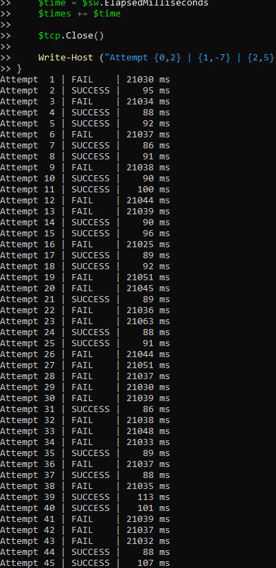
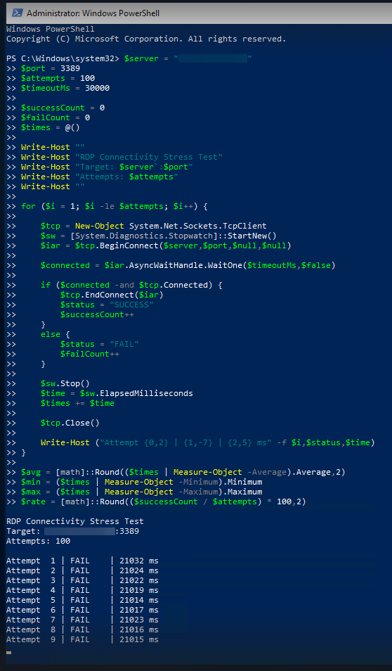

# rdp-connectivity-diagnostic

PowerShell utility used during troubleshooting of intermittent RDP connectivity issues affecting AWS-hosted environments.

---

# Overview

This script repeatedly tests TCP connectivity against a target endpoint and records:

- successful/failed connections
- timeout behavior
- millisecond response times

The goal of this script:

Produce repeatable connection data during an active production troubleshooting session where standard ping testing and manual RDP attempts were not giving enough useful information to isolate root cause or escalate.

---

# Problem

Customers & Staff were experiencing widespread/intermittent RDP connection failures into hosted AWS EC2 environments.

Behavior was inconsistent:

- Most sessions connected instantly
- Many sessions required 5-10 attempts before connecting

The issue was difficult to isolate because failures were intermittent and not easily reproducible on demand across all AWS EC2 instances.

A repeatable stress-style connectivity test was needed to gather larger samples of connection behavior over time.

---

# Solution

The script uses repeated TCP socket connection attempts to test connectivity against a target endpoint.

During troubleshooting, the script went through multiple iterations while testing different timeout values, attempt counts, and output formatting.

One of the more useful findings was that many failed attempts consistently clustered around ~21 second timeouts, suggesting repeated underlying TCP/RDP retry behavior before full connection failure.

The resulting data helped support escalation and troubleshooting efforts involving the corporate ISP/data center provider.  By not escalating to AWS Support directly, we avoided unnecessary AWS Enterprise Support escalation costs by isolating the issue to our corporate data center.

---

# Requirements

- Windows PowerShell
- Network connectivity to the target host

---

# Usage

Most of the time, only the target host needs to be changed.

```powershell
.\Test-RdpConnectivity.ps1 -TargetHost example.com
```

Longer stress test:

```powershell
.\Test-RdpConnectivity.ps1 -TargetHost 203.0.113.10 -Attempts 500
```

Custom timeout:

```powershell
.\Test-RdpConnectivity.ps1 -TargetHost server.example.com -TimeoutMs 30000
```

---

# Example Output

```text
Attempt   1 | FAIL    | 21030 ms
Attempt   2 | SUCCESS |    95 ms
Attempt   3 | FAIL    | 21034 ms
Attempt   4 | SUCCESS |    88 ms
```

---

# Screenshots

## Failure Pattern Example



## Script In Use During Troubleshooting



---

# Notes

- This script performs TCP-Socket connectivity testing only.
- Successful TCP connections do not guarantee successful RDP authentication.
- Although originally built for RDP troubleshooting, the script can test any TCP port.

